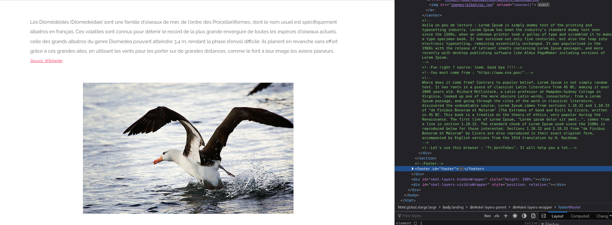

## Secret Ressource Hidden

Here on @BornToSec there is a secret, here we see a part of it : 


## Decriptage

We have to browser from ``` ft_bornToSec```
So we use option User-Agent (-A) for specifie the browser    
We come from ```"https://www.nsa.gov/"```
So we use Referer (-e) to indicated the origine url 

 ```bash
 curl.exe -e "https://www.nsa.gov/" -A "ft_bornToSec" "http://192.168.56.101/?page=b7e44c7a40c5f80139f0a50f3650fb2bd8d00b0d24667c4c2ca32c88e13b758f" > test.txt
 ```