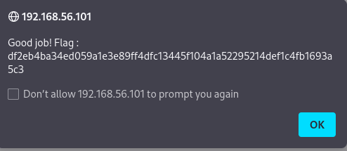

## Weak cookie

We see in all pages the I_am_admin cookie, 
if we take the cookie and put it on internet, the first site is a convertor md5.
The cookies translate to false
So we try to convert True in md5 and past it as the new cookie.  
Refresh the page, and tada  you got the Flag

## Patch 

