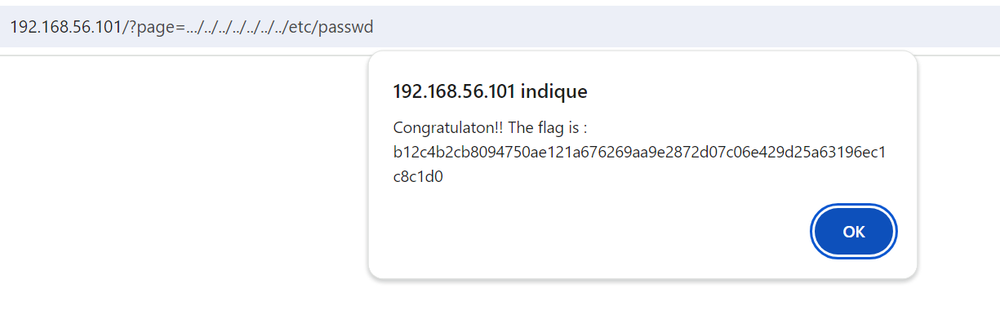

## Local File Inclusion (LFI) / Remote File Inclusion (RFI)


On linux /etc/passwd is use to store information on systeme's user.


Page parameter can be exploite to access sensible file here. 
To reduct the posibility of RFI we can unable some PHP configuration and une whiteliste. 
Here ```../../../../../../../etc/passwd``` give use the flag


## Patch 
- Desable ```allow_url_fopen``` and ```allow_url_include``` using PHP

- Use a list of allowed page like
```php
$allowed_pages = ['home.php', 'contact.php'];

if (in_array($_GET['page'], $allowed_pages)) {
    include($_GET['page']);
} else {
    echo "Access Denie"
}
```
