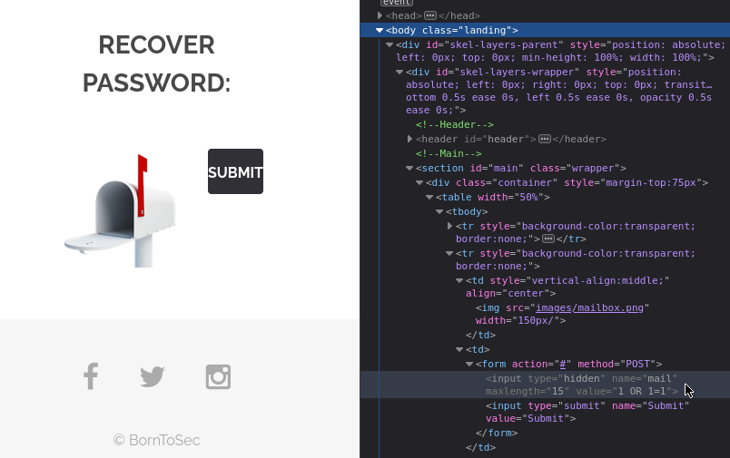

## Recover Password 
In url ```http://x.x.x.x/?page=recover``` we can submit to recover our password.   
The value of the of the email is hide in the html page : 
```<input type="hidden" name="mail" value="webmaster@borntosec.com" maxlength="15">```

If you change the value of the email and submit it, it will give you the flag.

## Patch
Do not hide sensitive information in front element,   
Here, you are recover password for admin, the process should use an email address in the database. 


