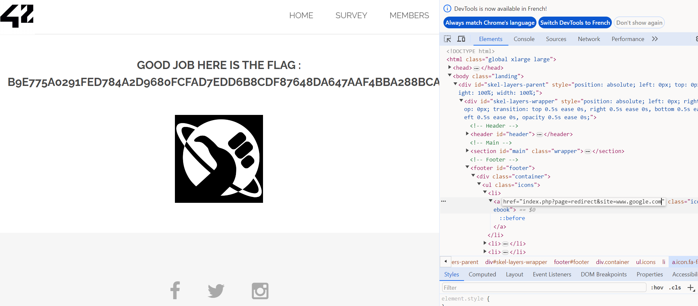

## Redirection Website

In searchimg, ID 5, we see an URL we could want to access... borntosec.ddns.net/images.png
At the end of the main page, there are some Social Media redirection, which can be used to trick the server (ssrf).
As the website is store on the page, and the page use a requests that use the store information, that can be change...   
To exploit that we can change those variables.  
http://IP/index.php?page=redirect&site=borntosec.ddns.net/images.png

## Patch 
Use database or environnement variable to store this type of information or use a GET method.
Always validate variables input.

