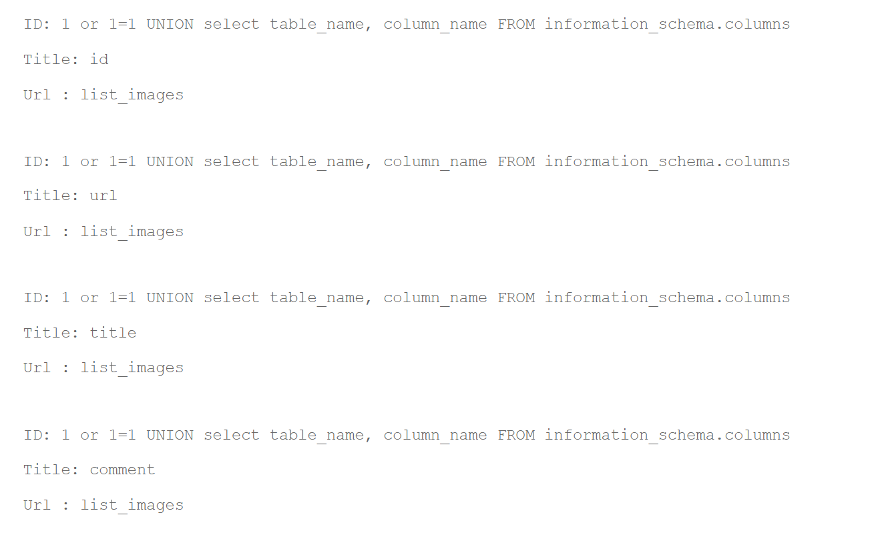
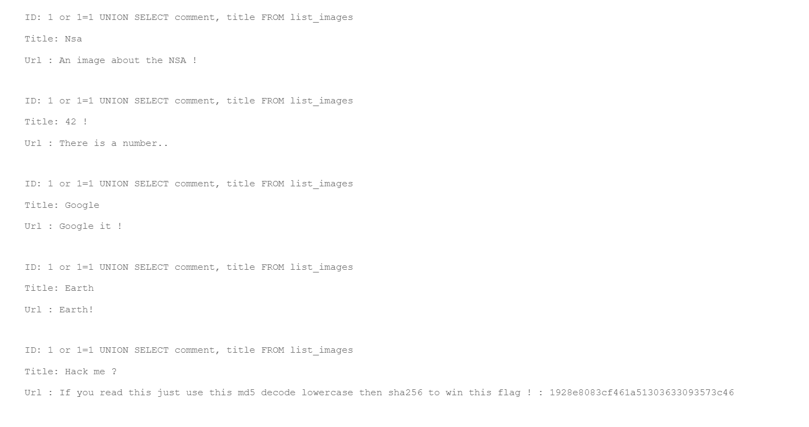

## SQL Injection

Here we can search for image.

Using a quick ```1 OR 1 = 1``` show us all the image url and title. That confirme SQL inujection is possible.   

To go futher, we gonna look for the tablename of the db's table.  
To do so we are gonna use basic SQL input using UNION to get all table_name and column : ```1 or 1 = 1 UNION select table_name, column_name FROM information_schema.columns```



We see here that the image are store in ```list_images```
that have 4 columns :
```
- id
- url
- title
- comment
```

So now we are looking in the comment section to look throw interessing information : 
``` 1 or 1 = 1 UNION SELECT comment, title FROM list_images```



Here is the flag !!!!
1928e8083cf461a51303633093573c46 have to go throw md5 and that it.

## PATCH 
Prepare the request and sanitize user input (use library to filter user input)