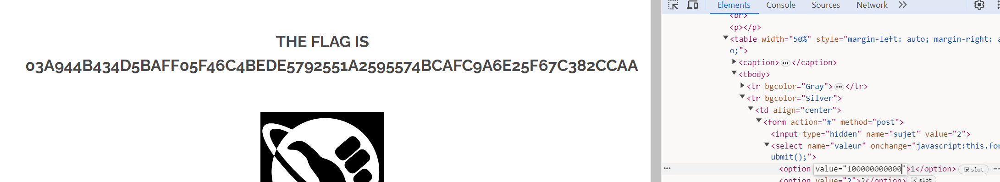

## Unprotected Value field

Here there are field to select value between 1 to 10 to add point to people.  
 The problem is that those value are not protected and we can change those in page's code   

 

curl -X POST "http://IP/?page=survey" -F "sujet=2" -F "valeur=10000000000000000000000"

 ## Patch 

- Check the value on the backend of the app.
- Use modern framework
